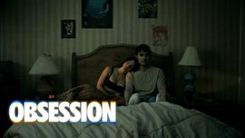

# Postarr

**Postarr** is an in development Python application that talks to your Plex Media Server and generates Netflix-style animated screensavers from your unwatched media, for use on home server set-ups such as Nvidia Shield.

It scans your Plex libraries for anything you haven't watched yet, pulls high-quality logo and background artwork from TMDB and composites them into a short MP4 with a slow Ken Burns-style zoom and a drifting logo — ready to drop into a folder your device's screensaver/dream app can point at.

## Examples

| |  |
|---|---|
|  |  |

## How it works

1. **Scan Plex** — connects to your Plex server and pulls all unwatched movies/episodes from the libraries you configure. Resolving TMDB/TVID ids

2. **Track state** —  keeps a local SQLite database of every title Postarr has seen, so items that already have a screensaver are skipped on future runs.

3. **Fetch artwork** — calls the TMDB for each new item, picking the best-rated textless logo and backdrop.
4. **Generate the screensaver** — The background is resized/cropped to 1080p and slowly zoomed over the clip duration while the logo is composited on top and drifts horizontally.

5. **Output** — Finished `.mp4` files are written to `OUTPUT_PATH`, named `{tmdb_id}_screensaver.mp4`, and the database record is updated. Local artwork (logo/background PNGs) is deleted after the video is built.

## Set-up

1. **Clone the repo**
   ```bash
   git clone https://github.com/Fordcois/Postarr.git
   cd postarr
   ```
2. **Install dependencies**
   ```bash
   pip install -r requirements.txt
   ```
   You will also need [ffmpeg](https://ffmpeg.org/) available on your PATH for MoviePy to render video.

3. **Getting Your API Keys**
   - **TMDB**: [Sign up free](https://www.themoviedb.org/settings/api)
   - **FanartTV**: [Free tier](https://fanart.tv/get-an-api-key/)
   - **Plex Token**: [Instructions](https://support.plex.tv/articles/204059436/)

4. **Copy `.env.EXAMPLE` to `.env` and fill in your details**
   ```
   FANARTTV_API_KEY = <your FanartTV API key>
   TMDB_API_KEY      = <your TMDB API key>
   PLEX_SERVER_URL   = http://<your-plex-ip>:32400
   PLEX_TOKEN        = <your Plex auth token>
   OUTPUT_DESTINATION = <base path for outputs>
   ```
5. **Modify `config.py`** to match your setup — in particular `CONTENT_LIBRARIES` (your Plex library names) and `BASE_PATH`/`OUTPUT_PATH` (where generated screensavers get written). Other tunables include screensaver `FPS`/`SCREENSAVER_DURATION`, `ZOOM_END`, and logo sizing/drift/offsets.
6. **Run the app**
   ```bash
   python app.py
   ```
   Point your Nvidia Shield (or other device) at the `outputs` folder to use the generated videos as a screensaver source.

## Roadmap

- Improve database handling so media watched since the last run is removed/cleaned up automatically
- Web UI to preview and modify which artwork is used per title
- Jellyfin / non-Plex media server integrations
- FanartTV fallback when TMDB artwork is incomplete
- Scheduling/cron support for automated, unattended generation
